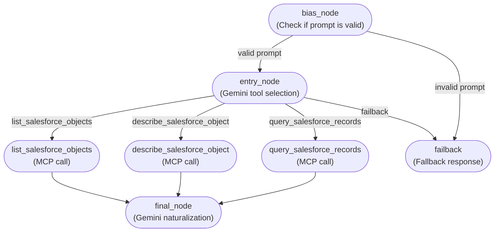
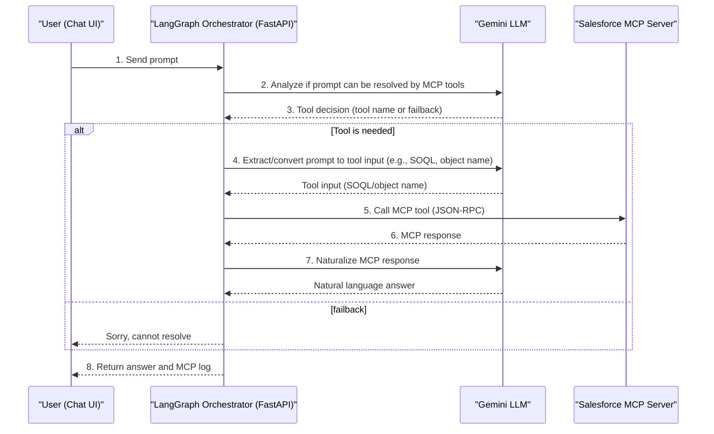
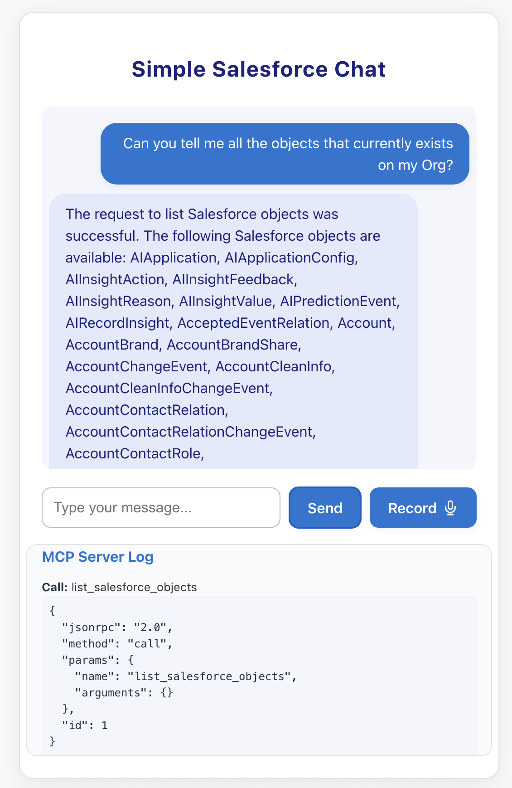
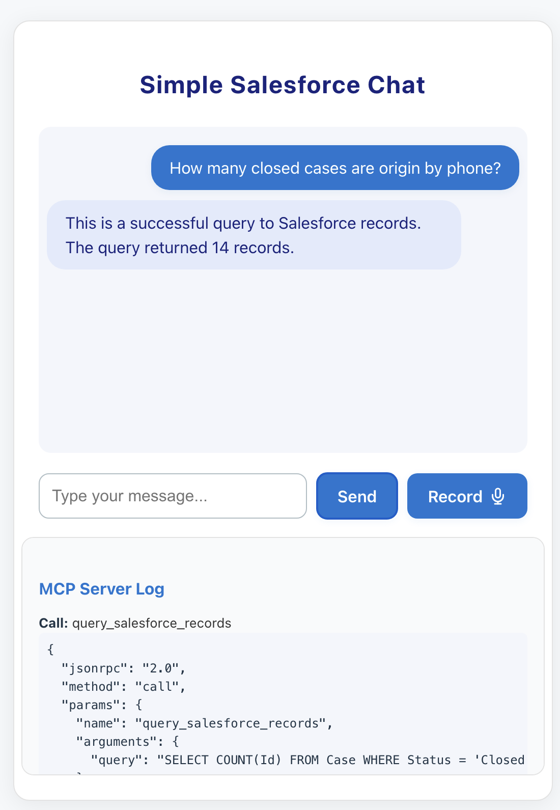

# Simple LangGraph Salesforce Chat

## Project Description

This is a multi-tier project that launches:
- A chat interface (React frontend) - Powered by with vite.js
- A LangGraph orchestrator (FastAPI backend) - Powered by with Gemini LLM
- A Salesforce MCP server (FastAPI backend) - Supports querying, describe and list Objects

Below is a high-level flow diagram of the LangGraph node orchestration:
---

---

The system works as follows:
1. **Read a prompt from the customer** via the chat UI.
2. **Analyze if the prompt can be resolved using Salesforce MCP tools** (using Gemini LLM and tool definitions).
3. **If yes, check which tool is needed** (tool selection via LLM).
4. **The prompt is analyzed to extract and convert into the inputs of the MCP server** (e.g., SOQL query or object name extraction).
5. **MCP server tool is requested** (via JSON-RPC call).
6. **MCP response is analyzed and converted into Natural Language** (using Gemini LLM for summarization).
7. **Callouts against MCP are logged to analyze output** (visible in the chat UI for transparency and debugging).

---



This project is completely developed using 'vibe coding' after several hours of reading and testing how different tools must work together.

---

## Project Installation

1. **Clone the project from GitHub:**
   ```bash
   git clone https://github.com/edutrujillo/simple_langgraph.git
   cd simple_langgraph
   ```

2. **Configure environment variables:**
   - Create a `.env` file in the `backend/` and `mcpsalesforce/` folders (or export variables in your shell):
     - `SALESFORCE_ACCESS_TOKEN` (Salesforce OAuth token)
        - Get it executing `sf org login web --instance-url ${SALESFORCE_ENDPOINT} --json` on your terminal (using Salesforce CLI)
     - `SALESFORCE_DOMAIN` (e.g., `https://your-instance.my.salesforce.com`)
     - `SALESFORCE_VERSION` (e.g., `v64.0`)
     - `GEMINI_API_KEY` (Google Gemini API Key)

3. **Create a Python virtual environment and install dependencies:**
   ```bash
   cd backend
   python3 -m venv venv
   source venv/bin/activate
   pip install -r requirements.txt
   ```

4. **Install frontend dependencies:**
   ```bash
   cd ../frontend
   npm install
   ```

5. **Start all servers:**
   - **MCP Salesforce server:**
     ```bash
     cd ../mcpsalesforce
     uvicorn main:app --reload --port 8010
     ```
   - **LangGraph orchestrator backend:**
     ```bash
     cd ../backend
     uvicorn main:app --reload --port 8000
     ```
   - **Frontend React app:**
     ```bash
     cd ../frontend
     npm run dev
     ```

---

## Example of Use

### 1 - List objects example
Using Natural Language, you can ask this agent for the list of existing objects in your Salesforce Org.

**Prompt:**
```
Can you tell me all the objects that currently exists on my Org
```



---

### 2 - Query example
Using Natural Language, you can ask this agent to formulate and execute a query against the connected Salesforce Org.

**Prompt:**
```
How many closed cases are origin by phone?
```



---

Interact with the chat UI, ask Salesforce-related questions, and see how the system routes, processes, and logs each step from prompt to natural language answer. 
